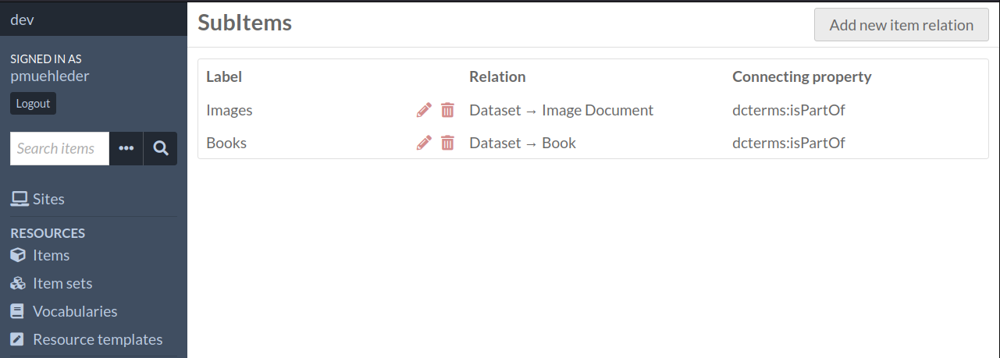
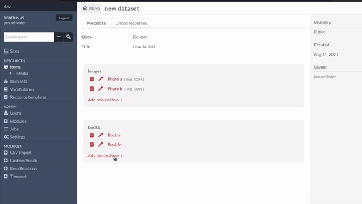

# Omeka S Module Item Relation

This module allows the definition if hierarchial item relations and simplifies the process of creating related items.

## Requrirements

* Omeka S > 3.0.0

## Usage

### Installation

Download the repo and copy its content into the Omeka S `modules`directory. The directory name must be `ItemRelation`. Then install the module in the admin panel under `Admin > Modules`.

### Define item relations

You can define item relations in the admin panel under `Modules > Item Relations`. Item relations are always hierarchically defined between two resoruce templates.

To create a new relation, press the `Add new item relation` button in the top right and fill out the form. 

|    |   |
| --- | --- |
| Label | Name of the relation, is also used as the widget title |
| Parent resoruce template | |
| Child resource template | Resource template of the related items |
| Connecting property | Property which connects the two items (e.g. `dcterms:isPartOf`), will be automatically added to a newly generated related item | 
| Label property | Title property of the related items |
| Code property | (optional) additional identifier property |
| Code template | (optional) template string for the code property e.g. `<parent> __ IMG __ <count> __ <title>` |

### Create related items

If an item relation is defined for a item's resource template (`Parent resource tempalte`), a widget is added to the item's view. This widget provides an overview of all related items as well as a form to create a new related item. This form creates a new item with the specified resource tempalte (`Child resoruce template`) and sets the label, code and connecting properties accordingly. 

## Authors

kompetenwerkd@saw-leipzig.de

## License

GPLv3

## Copyright

2021, Sächsische Akademie der Wissenschaften zu Leipzig